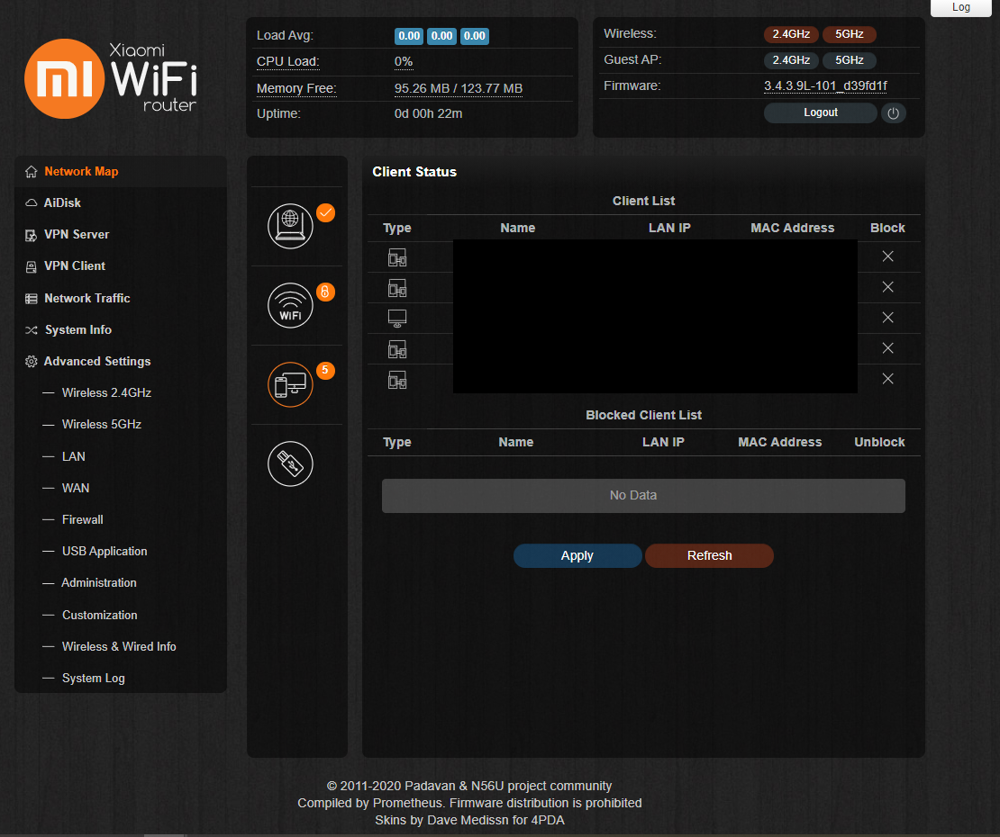
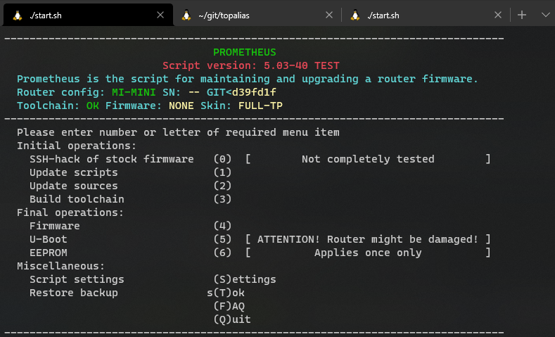
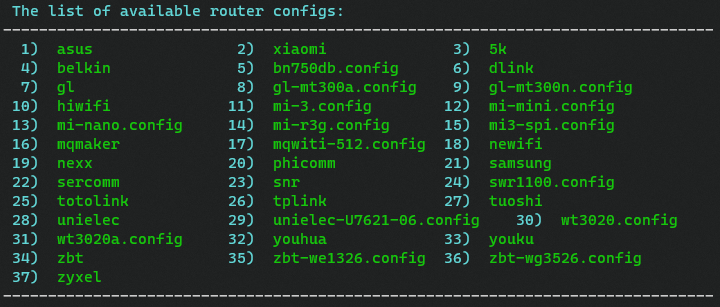

# README #

Welcome to the rt-n56u [padavan-ng](https://gitlab.com/dm38/padavan-ng) project (XRMWRT, based on stock Asus firmware for the RT-N56U, _not_ OpenWrt) - open-source embedded operating systems based on Linux. You can build your own firmware for home Wi-Fi router from source with ENTWARE package manager (need insert USB flash drive).

This project aims to improve the rt-n56u and other supported devices on the software part, allowing power user to take full control over their hardware.
This project was created in hope to be useful, but comes without warranty or support. Installing it will probably void your warranty. 
Contributors of this project are not responsible for what happens next.



### How do I get set up? ###

* [Get the tools to build the system](https://bitbucket.org/padavan/rt-n56u/wiki/EN/HowToMakeFirmware)
* Feed the device with the system image file (Follow instructions of updating your current system)
* Perform factory reset
* Open web browser on http://my.router or http://192.168.1.1 to configure the services

#### Prometheus

Text based interactive configrator for rt-n56u project (padavan-ng). Alternative easy  and fast way requiring fewer skills with configuration, firmware and backup management. Support English, Russian, Espanol and Simplified Chinese languages.

**Install:**
```bash
mkdir prometheus-padavan
cd prometheus-padavan
wget -O start.sh http://prometheus.freize.net/script/start-99.sh
chmod +x start.sh
./start.sh
```



**Features:**
* Auto-install build requirements on start
* Build toolchain (build tools for build router firmware from Linux source)
* Build firmware with given configuration
* Flash firmware
* Restore backup from your device
* Select a firmware from the archive
* Select/update modules: Exemple, MAC, Cleaning, TOR, ENTWARE, Patch
* U-Boot: flash/update, build from source, restore stock
* SSH-hack of stock firmware
* Flash EEEPROM patch for signal issues.
* Connection parameters (default: 192.168.1.1, admin/admin - **ALWAYS** need change to you values from default for **security** reason). Always set strong login/password for Web UI and long, no dictionary Wi-Fi password.
* Update sources from padavan-ng repository or any different
* Update scripts
* Show script version, router config, S/N, repository git commit of local source code, build status for toolchanin & firmware, skin, about.

_Configuration:_
1. SMB and WINS server
1. NFSv3 server
1. NFSv3 client
1. SMB client
1. TCPDUMP utility
1. PARTED utility
1. OpenSSH
1. OpenVPN
1. SFTP-server
1. USB-Audio modules
1. OpenSSL
1. Elliptic Curves (EC)
1. Transmission
1. Transmission Web
1. FTP server
1. xUPNPd IPTV
1. Minidlna UPnP
1. Firefly iTunes
1. Aria2
1. Aria2 WEB control
1. Alternative RP-L2TP
1. FFmpeg & INSTEAD
1. Replace 'Reset' button with 'WPS'
1. Enable RED LED for WAN

_Themes:_
1. Skins core
1. Dark-grey theme
1. Dark-grey theme (vector)
1. Blue theme
1. Dark-blue theme
1. Yellow theme
1. White theme

Requires Ubuntu/Debian, work fine in Ubuntu 18.04 (tested), should work in Windows Subsystem Linux (WSL).
| OS | Run script | Build toolchain | Build firmware | Install firmware | Other |
| --- | ---------- | --------------- | -------------- | ---------------- | ----- |
| Ubuntu 18.04 64-bit | + | + | + | + |  |
| WSL: Ubuntu 20.04 | Run with errors:<br><span style="color:#CCCCCC;background-color:#0C0C0C;">W: --force-yes is deprecated, use one of the options starting with --allow instead.</span><span style="color:#E74856;background-color:#0C0C0C;"> Software installation error!  Press any key to continue...</span> | + | Build error:<br><span style="color:#CCCCCC;background-color:#0C0C0C;">libiconv/iconv.c:103:47: warning: missing braces around initializer [-Wmissing-braces]  checking for Doxygen tools... checking for dot... not found  checking for doxygen... not found  ./autogen.sh: 35: intltoolize: not found  make[3]: \*\*\* [Makefile:22: configure] Error 1  make[2]: \*\*\* [Makefile:15: config\_test] Error 2  make[1]: \*\*\* [Makefile:179: all] Error 2  make: \*\*\* [Makefile:184: user\_only] Error 2</span> |  |  |
|  |  |  |  |  |  |
|  |  |  |  |  |  |

Hardware device support:
* **Xiaomi**: MI-MINI, MI-NANO, MI-3, MI-3C, MI-R3G, MI-4
* **ASUS**: RT-AC1200HP, RT-AC51U, RT-AC54U, RT-N11P, RT-N14U, RT-N56U, RT-N56UB1, RT-N65U
* **ZyXEL Keenetic**: 4g3, extra, giga3, lite2, lite3, omni, omni2, ultra2, viva
* NEXX WT3020 (A,H,F), Belkin N750 DB, Samsung CY-SWR1100
* And other, see full model list in script menu.



After enter **2**:


Script community support: [Russian pda developers board, forum thread](https://4pda.ru/forum/index.php?showtopic=714487)

### Wiki

Knowledge base: https://gitlab.com/CSRedRat/padavan-ng/-/wikis/Home

### Contribution guidelines ###

* To be completed

P.S.
Original project author is Padavan. Old repository here: [rt-n56u project](https://bitbucket.org/padavan/rt-n56u)

GitHub mirror: https://github.com/CSRedRat/padavan-ng-rt-n56u-xiaomi-prometheus-openwrt
